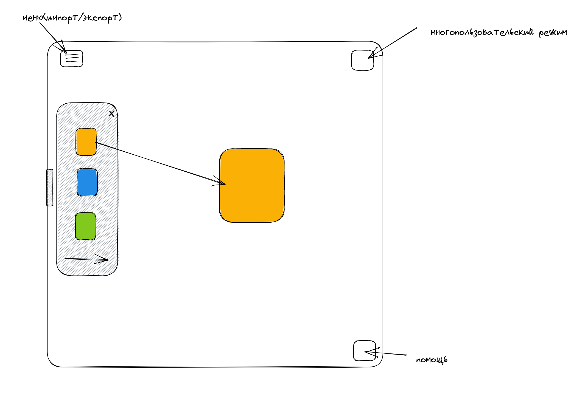
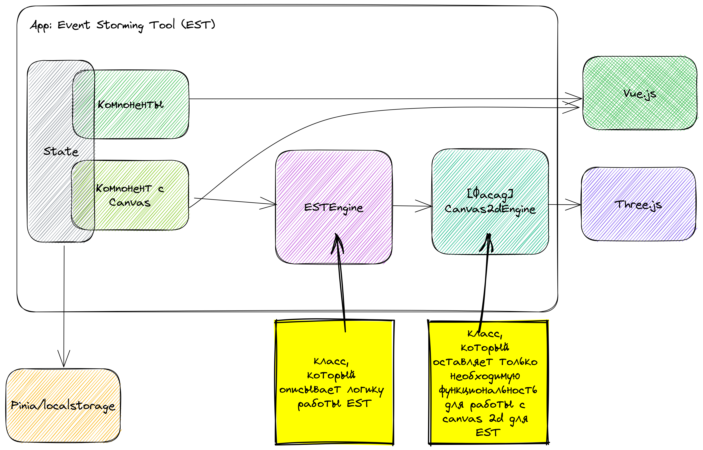

# 1. Инициализация проекта (начало проектирования)

Дата: 2022-03-12

## Статус

принятый (accepted)

## Контекст

Согласно [ФТ](../functional-requirements/fr-mvp-event-storming.md) нужно реализовать инструмент для проектирования систем, который будет использовать подход Event storming. Для этого необходимо изучить материалы по Event storming. На официальном сайте предлагается [книга](https://www.eventstorming.com/book/).

## Решение

Текущие решение проектируется для MVP.

### Доступность проекта

1. сделать web решение
2. сделать кроссплатформенное решение на одной технологии
3. сделать кроссплатформенное решение для каждый платформы конкретно

web-решения - сделать быстрее и доступнее + имеется опыт в этом направлении.

Недостатки такого подхода, нет оптимизации под конкретную платформу, производительность будет хуже, чем если реализовывать все нативным образом.

### UI/UX

1. Выбрать UI библиотеку
2. Выбрать CSS framework
3. Найти дизайнера, который пропишет дизайн проекта

В данном случаи UI библиотека, может создать доп ограничения в будущем, которые будет сложно обойти. В тоже время дизайнер для opensource проекта на этапе MVP слишком дорог. Так что склоняюсь к использованию CSS framework + БЭМ методология, в качестве CSS framework думаю использовать Tailwind CSS.

Для проработки UX планируется использовать обратную связь от пользователей проекта.

Недостатки: Кастомное решение обычно лучше, к тому же дизайнер сможет лучше проработать UI/UX.

В качестве js framework/library планируется выбрать Vue3 (+ экосистему vue), тк имеется опыт.

Недостатки: Технология X может быть производительнее и иметь лучше поддержку от сообщества.

Выбор движка для канваса:

1. 2d js движок [pixi.js](https://github.com/pixijs/pixijs)
2. webassembly

Планируется выбрать js движок - three.js, тк с ним был опыт и больше примеров, большая поддержка сообщества

Webassembly - перспективнее за счет свой производительности, имеет смысл перейти на него в 2 версии, при условии, что будет получен фидбэк от пользователей о нехватке производительности для больших диаграмм.

### Удобства распространения

1. Сборка из исходников
2. Docker

Первый пункт будет доступен по дефолту, так же пользователи получат возможность сделать свой форк и вносить изменения. Второй пункт позволит быстро запускать проект на сервере, те удобный вариант self-hosted решения.

### Прототип UI/UX

### Общая схема

## Последствия

С одной стороны получится сделать быстрое решение, которое будет запускаться в браузере.

С другой может пострадать производительность на большом количестве элементов.
